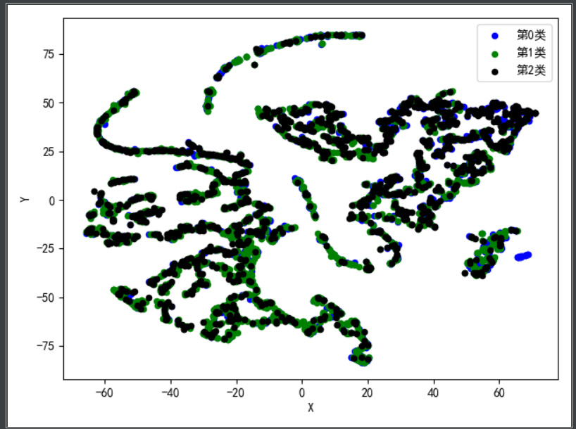

# imdb_data_ming
##V1/
处理数据集，完成关联分析，聚类分析，预测问题。
###**关联分析**：
    将需要关联的列数据放入同一个list中，创建相关项，得到类似如下的数据集：
    [
        ['color', 'James Cameron', ...],
        ['black and white', 'Gore Verbinski'],
    ]
    然后使用apriori算法来找出频繁项集
###**聚类分析**
    将文本数据转为onehot向量，主要是导演，电影类型，电影关键词等
    本实验尝试了三种聚类方法：层次聚类，划分聚类，密度聚类
    最终结果只有kmeans算法的效果可以接受，其他情况都似乎很糟糕
    
###**评分预测**
    采用神经网络来实现评分预测：
        主要是将所有列的文本数据集拼接成句子，然后进行分词后embedding，
        输入到cnn模型中进行预测，采用均方根误差作为损失函数。